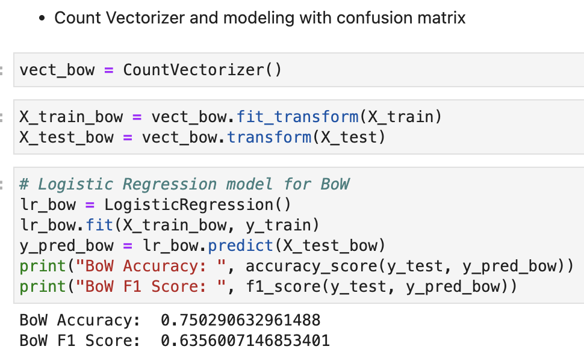
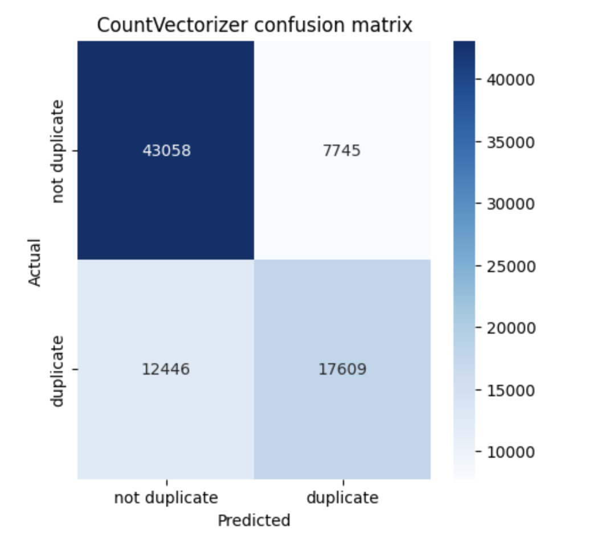
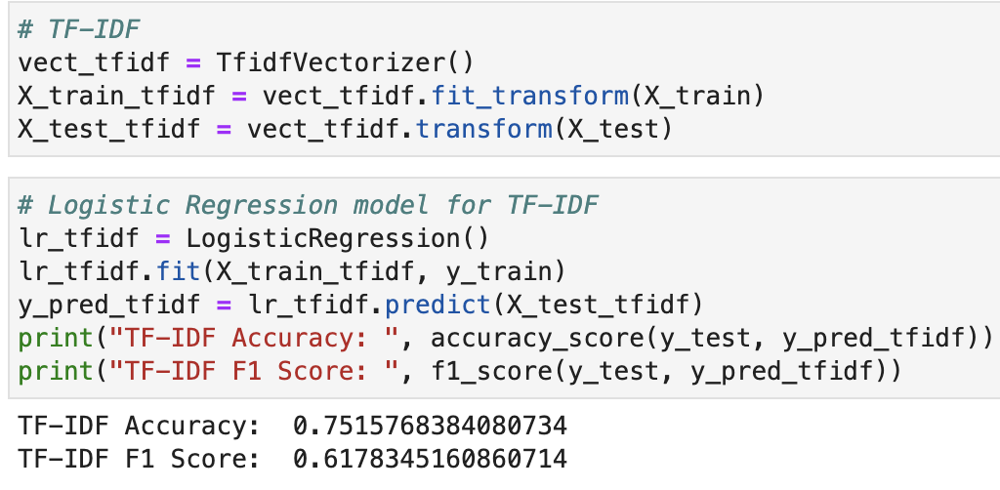
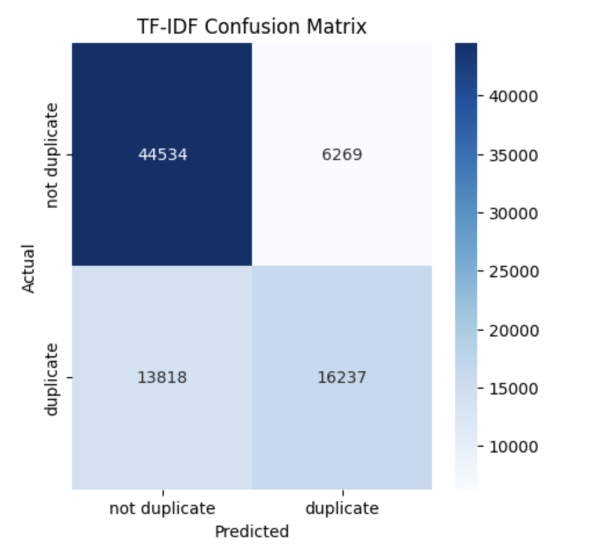
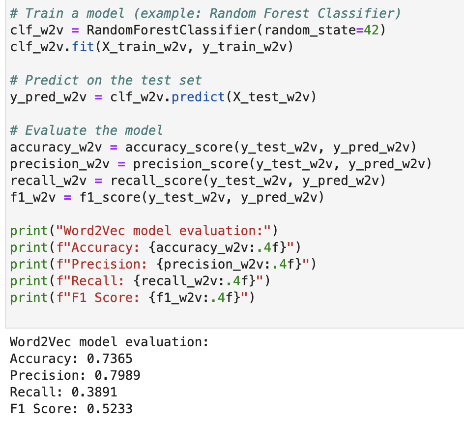
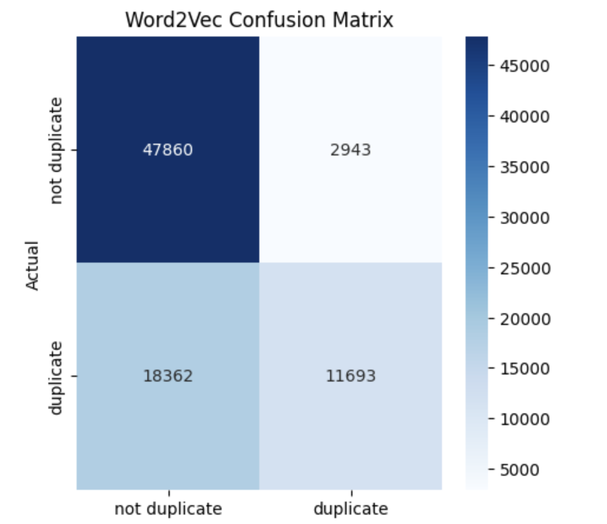
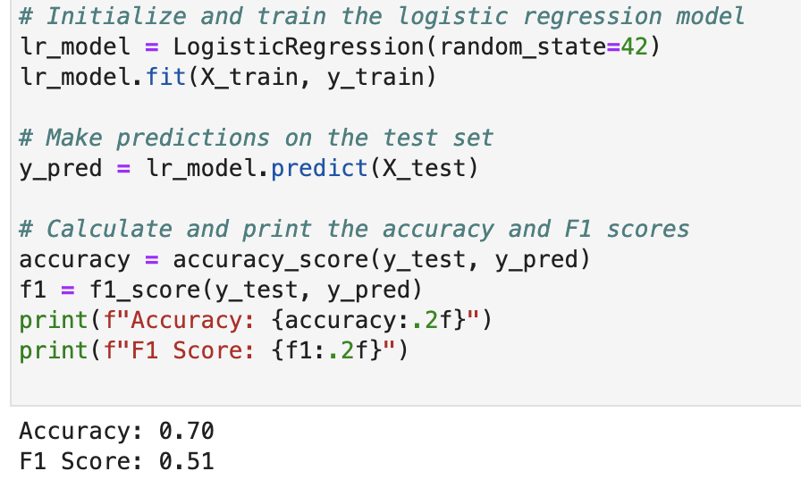
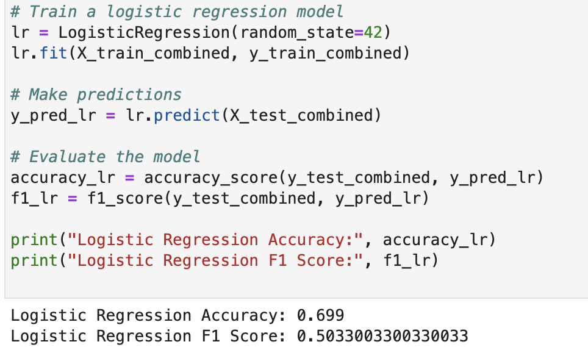

# mini-project-V (QUORA.COM ANALYSIS)

- Quora.com is a popular question-and-answer platform
- Users can ask questions on a wide range of topics and get answers from others
- Our objective is to build a classifier model that can identify duplicated questions on Quora using different techniques

### Workflow 

 #### EDA Phrase
 - Duplicated questions distributions as showed:

 - Drop missing values
 - Balanced dataset
 - Top_n words (for part 2) 
 
 #### Cleaning Phrase
 - Tokenization
 - Stopwords cleaning
 - Removing punctuation
 - Normalizing
 - Stemming
 
 #### Feature Engineering with Modeling 
  - Part 1 with only one feature ( BoW, TF-IDF, Word2Vec)
    I've tried different training techniques with different feature engineered techniques, only post here with the best result models. 
    1) BoW
  
  
  
    2) TF-IDF
  
  

    3) Word2Vec
  
  

 - Part 2 with two or more features and neural network training 
   1) with top_n word feature and TF-IDF together
   
   
   2) with TF-IDF and Word2Vec together
   
  
   3) With the feedforward neural network model
      Test accuracy: 0.6704999804496765